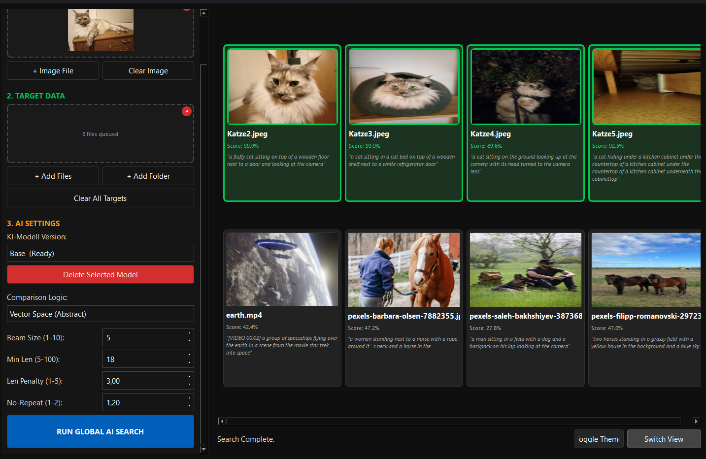

# Semantische Suche für lokale Medien

Diese Anwendung soll die inhaltliche Durchsuchung lokaler Bild und Videodateien per Text-Prompt oder Referenzbild ermöglichen. Durch lokale Modelle findet der gesamte Abgleich auf der eigenen GPU/CPU statt, wodurch die Daten privat bleiben und keine Cloud-Anbindung nötig ist.

Die ausführbare compilierte exe ist in GitHub unter dem Release Tab  herunter zu laden für entweder (falls cudafhige GPU vorhanden) CUDA oder CPU.

# Eingabe

Unter **AI Prompt & Image** kann je nach Suchmodus der zu suchende Begriff eingegeben werden oder ein Bild ausgewählt werden. Aus diesem Bild wird automatisch ein AI-Prompt generiert, den man anschließend selbst noch bearbeiten kann.

Unter **Target Data** sind die zu durchsuchenden Dateien bzw. Ordner einzufügen.

# Suche

Unter **AI Settings** kann man den Suchmodus einstellen. Entweder wird nach Keywords in den generierten AI-Prompts gesucht oder es werden die beiden Vektoren der Eingabe (Text oder Bild) und der zu durchsuchenden Dateien miteinander verglichen.

Aktuell kann man zwischen zwei Modellen auswählen, die sich hauptsächlich in ihrer Größe unterscheiden.

Zusätzlich kann man die Generierung der Prompts über einige Parameter beeinflussen:

**Beam Size** bestimmt wie viele mögliche Textvarianten das Modell gleichzeitig berechnet und miteinander vergleicht.

**Min Length** legt fest wie lang der generierte Prompt mindestens sein muss, damit das Modell nicht zu kurze Beschreibungen erzeugt, zu lange lässt das Modell allerdings halluzinieren.

**Length Penalty** beeinflusst ob das Modell eher kürzere oder längere Beschreibungen generiert. Je nach Wert werden längere oder kürzere Texte bevorzugt.

**No Repeat** bestraft wenn Wortfolgen mehrfach hintereinander generiert werden und reduziert so Wiederholungen im Prompt.

Bei der ersten Suche für ein Modell wird dieses automatisch heruntergeladen, was etwas dauern kann. Die Modelle sollten anschließend im selben Verzeichnis wie die exe unter dem Ordner **AI_models** auffindbar sein.

Testbilder sind im **test** Ordner des Projekts vorhanden.

